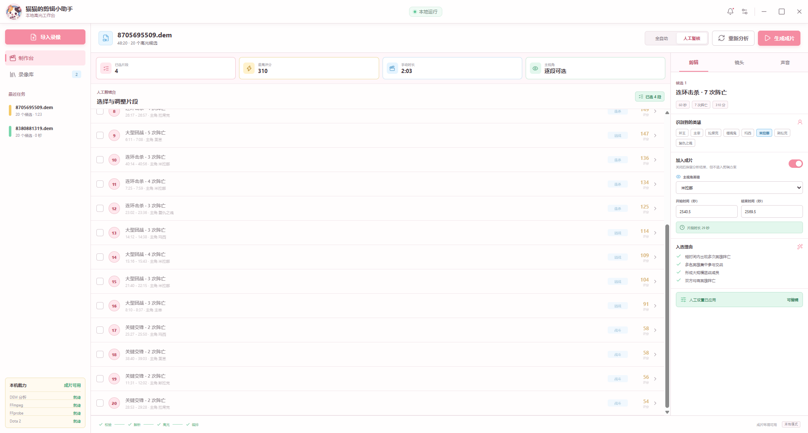

# 猫猫的剪辑小助手

一个面向 Windows 的本地 Dota 2 DEM 精确剪辑工具。

官方仓库：<https://github.com/luckcatlin2000/luckcaty-cut-dota2>

当前正式版：`1.8.0`。第一次了解本项目，可以先阅读[软件介绍](软件介绍.md)。

```text
导入 .dem
  -> 本地解析比赛与 10 人阵容
  -> 生成可解释的事件候选与故事场次
  -> 人工安排片段顺序、入点、出点、英雄和镜头
  -> Dota 2 按场次导出编号统一的独立机位素材
  -> FFmpeg 拼接、编码和质量检查
  -> 应用内播放 MP4
```

分析、选片和时间编辑不会启动 Dota 2。只有用户确认导出后，软件才会启动自己创建的 `-insecure` 离线回放进程，使用 Dota 2 原生观战与导出能力生成画面和游戏原声。项目不控制联网比赛、不注入游戏进程、不依赖 OBS，也不自动添加文案、BGM、配音或音效。

> **许可证提醒：源码公开不等于允许售卖。** 未经著作权人事先书面授权，禁止销售、收费分发、发布安装包、改名换皮、套壳发布或将本软件作为托管/商业产品提供。普通用户可以使用本软件剪辑、发布和变现自己的视频。



## 下载与更新

普通用户请前往 [GitHub Releases](https://github.com/luckcatlin2000/luckcaty-cut-dota2/releases/latest) 下载：

- `luckcaty-cut-dota2_1.8.0_x64-setup.exe`：推荐，双击后按提示安装。

安装版启动后会静默检查官方 Release。发现新版本时只提示，是否下载和安装由用户决定；软件不会后台自动下载，也不会强制更新。`1.6.0` 用户需要先手动安装一次 1.7 或更高版本，之后才可使用应用内更新。

官方 1.8.0 安装包包含已核验的 FFmpeg/FFprobe 参考构建，许可证和来源记录见 `tools/ffmpeg/`。Git 仓库不提交这些二进制；自行构建时需要按“开发”章节提供本地 FFmpeg。Release 说明会列出 SHA-256 供核对。

安装包目前没有商业代码签名证书。Windows 如果显示 SmartScreen 提醒，请先核对下载地址属于本官方仓库，并核对 Release 中的 SHA-256；不要从第三方网盘、店铺或重新打包的网站下载。

## 功能

- 选择、拖入 `.dem`，或自定义录像目录后输入纯数字录像编号载入；原文件始终只读。
- 不启动 Dota 2 即可解析比赛信息、事件候选和完整 10 人英雄阵容。
- 以击杀、技巧互动、团战和地图目标四条轨道查看整局或所选英雄相关事件。
- 支持米拉娜连续击杀段，以及经过实体与指令证据验证的风行者补刀斧砍树互动。
- “高光内容”可选择全部、击杀或砍树；未知文本整体拒绝，不使用云端 AI 猜测。
- “故事”页把有证据的精彩操作、趣味互动和明确失误组织为剧情节拍，低置信结果要求人工复核。
- 导演按剧情决定机位：普通场次可只有玩家视角，关键动作才增加英雄近景备用素材。
- 同一场次的机位使用相同时间码，按 `S001-A`、`S001-B` 编号导出独立 MP4。
- 默认成片只使用主机位；备用特写不会被顺序追加造成重复时长。
- 增删、复制、排序片段并精确编辑 `HH:MM:SS.mmm` 时间，支持 30 FPS 单帧微调。
- 使用 Dota 2 原生 `startmovie/endmovie` 导出帧序列与 WAV，再由 FFmpeg 编码和质量检查。
- 导出完成后可在应用内播放、外部播放或打开成片及源素材目录。
- 设置面板显示“作者：猫猫只用虎”。

## 1.8.0 简介

- 新增版本化的故事、证据、置信度、剧情节拍和导演素材方案。
- 新增按剧情选择机位的同步素材组，统一场次编号与时间码。
- 每个机位导出为独立 MP4 并生成 `素材清单.json`；默认成片只拼接主机位。
- 保留 1.7 的人工精确剪辑、四轨时间轴、本地游戏原声和可选更新行为。

完整记录见 [CHANGELOG.md](CHANGELOG.md)。

## 使用流程

1. 安装并启动“猫猫的剪辑小助手”。
2. 点击“载入录像”，指定录像目录后输入编号；也可直接选择或拖入 `.dem`。
3. 在“故事”页采用有证据的导演素材方案，或在“镜头”页选择主角与内容规则。
4. 核对 `S001-A/S001-B` 等素材编号，并调整片段顺序、时间、英雄和镜头。
5. 点击“导出视频”复核源素材数量、默认成片时长和游戏原声。
6. 点击“开始导出视频”。渲染期间不要操作 Dota 2。
7. 完成后在应用内播放，或打开成片和源素材目录。

详细说明见 [使用与故障恢复](docs/USAGE_AND_RECOVERY.md)。

## 安全边界

- DEM 分析、候选检测、故事生成和时间编辑不会启动 Dota 2。
- 回放控制只连接 `127.0.0.1:29000`，客户端命令经过白名单。
- 软件拒绝接管用户已经运行的 Dota 2。
- 导出进程使用 `-insecure -vconsole -console`，任务结束后只关闭本项目启动的 PID。
- 原始 DEM、任务数据和媒体均保存在本机。

详细设计见 [回放控制合同](docs/REPLAY_CONTROL.md)。

## 开发

环境要求：Windows 10/11 x64、Rust 1.89 或兼容版本、当前 Node.js LTS 与 npm、FFmpeg/FFprobe；只有真实画面导出需要 Steam 版 Dota 2。

源码仓库不包含 FFmpeg 二进制。请将 `ffmpeg.exe` 和 `ffprobe.exe` 放入 `PATH`，设置 `FFMPEG_EXE` / `FFPROBE_EXE`，或放入被 Git 忽略的 `tools\ffmpeg\bin\`。

```powershell
cd .\apps\d2-highlights-desktop
npm ci
cd ..\..

.\scripts\verify.ps1
.\scripts\desktop-dev.ps1
```

发布者如需捆绑 FFmpeg，必须为实际二进制提供对应许可证、构建来源和源码材料。

## 仓库边界

仓库只包含源码、锁文件、构建脚本和维护文档，不提交 DEM、成片、任务缓存、`target/`、`node_modules/`、EXE、安装包、FFmpeg 二进制、本机路径、账号配置或私有素材。

本仓库只用于“猫猫的剪辑小助手”。README、About、Topics、Issues、Releases、Wiki 和附件不得混入、宣传或链接无关软件或其他产品。

## 许可证、商业使用与商标

本项目自有源码采用 [Cat Cut Assistant Source-Available License 1.0](LICENSE)，中文说明见 [LICENSE.zh-CN.md](LICENSE.zh-CN.md)。

允许查看、学习、编译、正常使用、制作并变现自己的视频，以及为官方仓库贡献代码。未经著作权人事先书面授权，禁止售卖或收费授权软件、分发修改版、改名换皮、套壳发布、并入其他产品或删除作者与来源信息。完整说明见 [品牌与商业使用规则](docs/BRAND_AND_COMMERCIAL_USE.md)。

此许可证属于“源码公开 / source-available”，不是 OSI 认可的开源许可证。第三方组件仍适用各自许可证，详见 [第三方组件说明](docs/THIRD_PARTY.md) 和 [第三方声明](THIRD_PARTY_NOTICES.md)。

Dota、Dota 2、Steam 及相关标志是 Valve Corporation 的商标。本项目是非官方社区工具，与 Valve Corporation 无隶属、赞助或认可关系；仓库不分发 Dota 2 客户端或 Valve 游戏资产。
